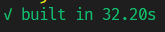

# Handy Tools I've Been Using Recently

So I've just been meaning to share my experience with tools that are fairly recent but also robust enough to recommend. 

## Codeium AI Coding Assistant

To be honest, at first I was sceptical about such tools and thought that I would "just write everything myself". But now it's a huge staple of my day-to-day work, making life so much easier. I'd say around 50% of the time I just hit that Tab button because the suggestions are spot on.

**Example**

<video controls="controls" src="/blog/codeium.mp4" />

It works especially well for repetitive tasks: writing tests, documentation, debugging. From what I've seen it can also generate well-known algorithms if that's what your app needs. 

## Vite, a Fast Dev Server and Module Bundler

I've first dabbled into Vite when trying to speed up our Storybook dev and build times. And have been a fan ever since. 

Where it differs from Webpack is that it doesn't bundle your files on every change. Instead, it serves native ES modules directly to the browser. Which makes development experience, well, **instant**.

For production builds Vite uses Rollup with good default configuration. And it's of course customizable too.

Here's an example of production build for a large and decently complex project:

**Webpack**

or 3.5 minutes

**Vite**

To be fair, there're ways to optimize Webpack builds too, however, Vite is still faster from what I've seen.

So that about wraps it up for this post. I suggest you check out Vite and Codeium. Let me know how it worked out for you or maybe suggest some nifty finds of your own. Peace!

